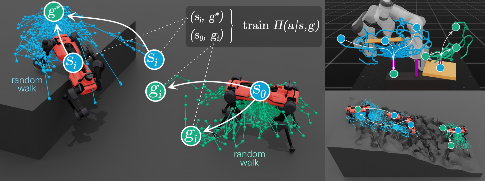

# BVER: Bidirectional Incremental Voronoi-biased Exploration Curriculum for Reinforcement Learning



BVER is an automatic curriculum for sparse-reward, long-horizon goal-conditioned RL. Inspired by bidirectional RRT, it grows start states outward from the goal and goals outward from the initial state distribution. Both sets are biased toward unexplored task space and toward each other, and one shared policy trains on both. No demonstrations or reward shaping are needed.

Project page and interactive demo: https://bver-rl.github.io/

## Installation

```bash
# 1. IsaacLab fork (pins the rsl_rl fork through isaaclab_rl/setup.py)
git clone -b bver-v1 https://github.com/bver-rl/IsaacLab.git
cd IsaacLab && ./isaaclab.sh --install rsl_rl && cd ..

# 2. This repo
git clone https://github.com/bver-rl/bver-rl.git
cd bver-rl && python -m pip install -e source/informed_exploration

# 3. Sanity check
python scripts/list_envs.py
```
